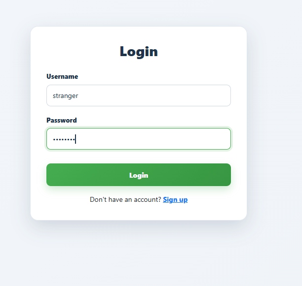
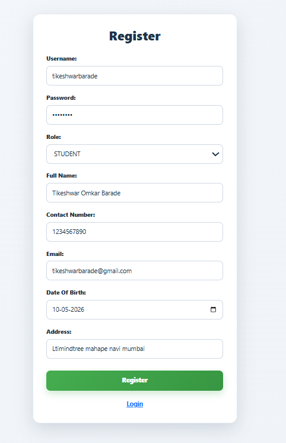
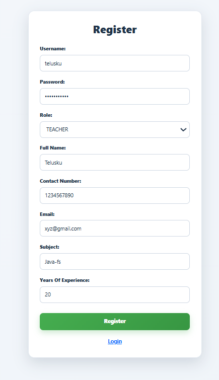
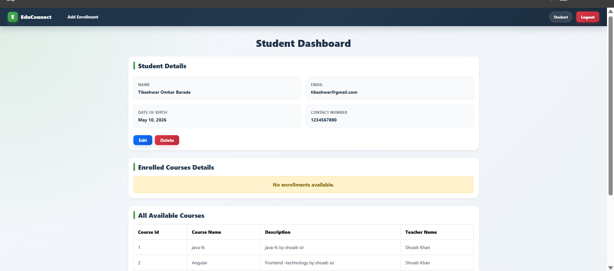
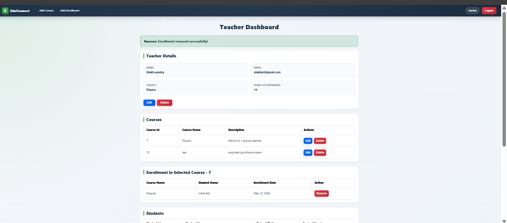
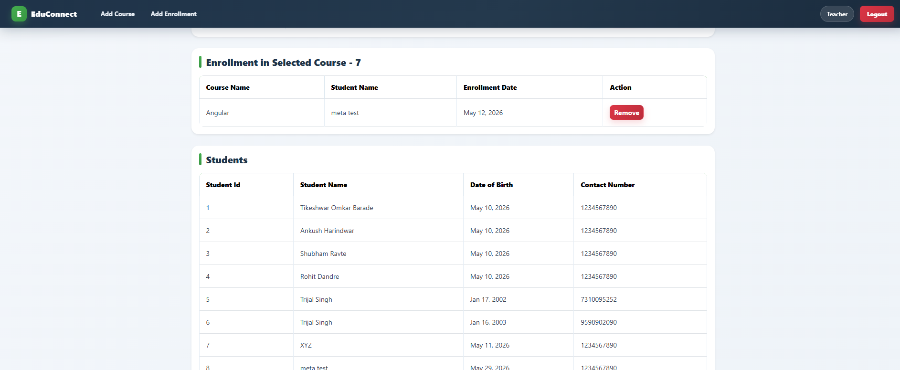
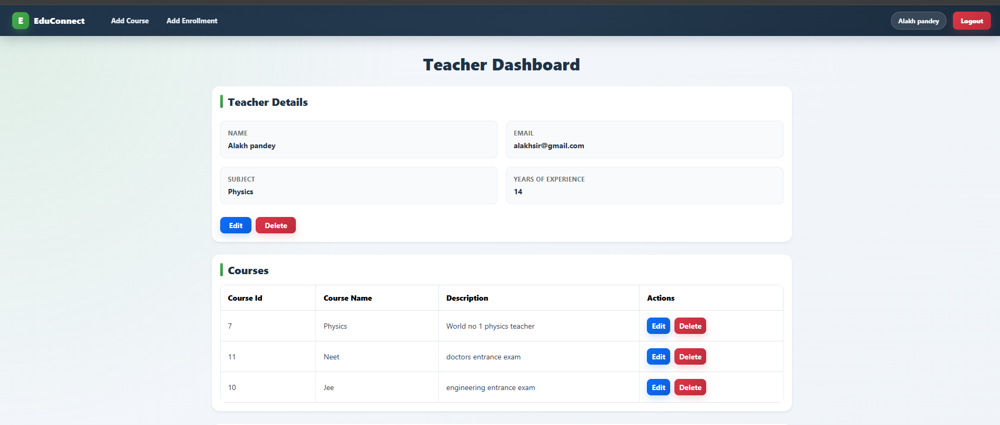
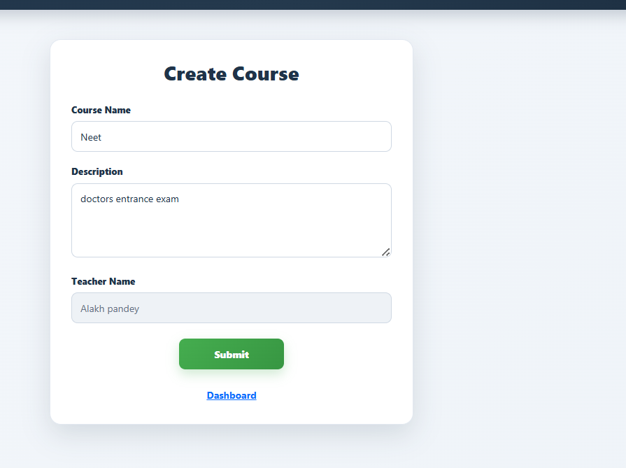
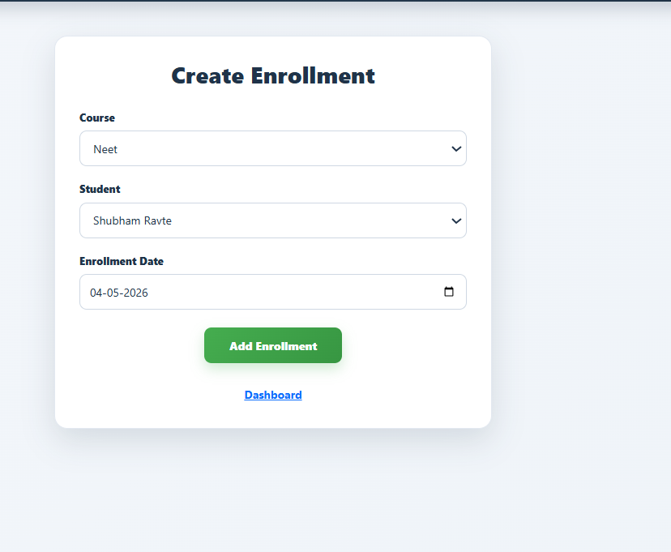
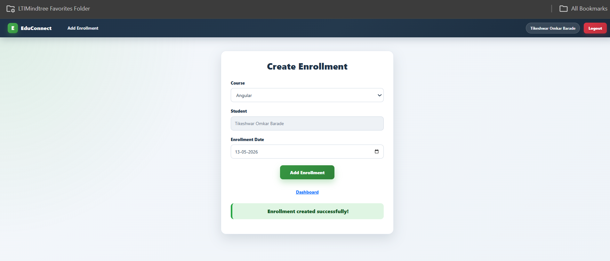

# EduConnect Application

EduConnect is a full-stack education management application built using **Angular**, **Spring Boot**, **Spring Security**, **JWT Authentication**, and **MySQL**.

The application provides separate workflows for **Students** and **Teachers**, including registration, login, role-based dashboards, profile management, course management, enrollment management, validation handling, and secure account deletion.

---

## Project Preview

### Login Page



### Student Registration



### Teacher Registration



---

## Dashboard Screenshots

### Student Dashboard



### Teacher Dashboard



### Teacher Dashboard - Course and Enrollment View



### Teacher Dashboard After Update



---

## Course and Enrollment Screenshots

### Create Course



### Create Enrollment - Teacher View



### Create Enrollment - Student View



---

## Features

### Authentication

- Student and Teacher registration
- Secure login using JWT authentication
- Role-based dashboard access
- Logout functionality
- Secure session handling using local storage
- Username update handling with automatic re-login flow
- Password protection to prevent overwriting already-hashed passwords during profile updates

---

## Student Features

- Student dashboard
- View student profile details
- Edit student profile
- Update username safely
- Automatic logout after username update
- Password is not editable from profile update page to prevent password overwrite
- Validation for:
  - Username
  - Email
  - Contact number
  - Date of birth
  - Address
- Date of birth cannot be a future date
- View all available courses
- Enroll in available courses
- Student can enroll only themselves
- View enrolled courses with course and teacher details
- Delete student account using a custom confirmation popup
- After account deletion, user session is cleared and redirected to registration page

---

## Teacher Features

- Teacher dashboard
- View teacher profile details
- Edit teacher profile
- Update username safely
- Automatic logout after username update
- Password is not editable from profile update page to prevent password overwrite
- Validation for:
  - Username
  - Email
  - Contact number
  - Subject
  - Years of experience
- Create courses
- Edit courses
- Delete courses
- View all students
- Create enrollments for students
- Remove enrollments
- Delete teacher account using a custom confirmation popup
- After account deletion, user session is cleared and redirected to registration page

---

## Course Management

- Teachers can create new courses
- Courses are linked with the logged-in teacher
- Teachers can edit course details
- Teachers can delete courses
- Students can view all available courses
- Course details display assigned teacher information

---

## Enrollment Management

- Students can enroll only themselves into available courses
- Teachers can enroll students into courses
- Duplicate enrollment for the same student and course is prevented
- Teachers can remove enrollments
- Student dashboard displays enrolled courses with teacher name
- Teacher dashboard displays course-wise enrollment details

---

## UI/UX Features

- Professional dashboard design
- Bootstrap-supported layout
- Custom SCSS styling
- Responsive pages
- Styled navbar
- Styled forms
- Custom delete confirmation modal
- Success and error message boxes
- Smooth animations
- Hover effects
- Professional color theme
- Responsive tables and cards

---

## Validation and Security Rules

### Registration Validation

- Username must contain only letters and numbers
- Password must contain:
  - Minimum 8 characters
  - At least one uppercase letter
  - At least one number
- Contact number must be exactly 10 digits
- Email must be valid
- Student date of birth cannot be in the future
- Teacher years of experience must be at least 1

### Profile Update Rules

- Password field is not shown in edit profile pages
- Password is not overwritten during profile update
- If username is changed, user must login again because JWT contains the old username
- Normal profile updates allow user to continue without logout

### Delete Account Rules

- Related data is deleted before deleting user account
- Frontend clears stored token and user details after account deletion
- User is redirected to registration page after account deletion

---

## Tech Stack

### Frontend

- Angular
- TypeScript
- Reactive Forms
- Bootstrap
- SCSS
- Angular Routing
- Angular HTTP Client

### Backend

- Java
- Spring Boot
- Spring Security
- JWT Authentication
- Spring Data JPA
- Hibernate
- REST APIs

### Database

- MySQL

---

## Project Structure

```text
EduConnect/
│
├── client/
│   └── Angular frontend application
│
├── server/
│   └── Spring Boot backend application
│
├── screenshots/
│   ├── createCourse.png
│   ├── createEnrollment.png
│   ├── createEnrollmentStudent.png
│   ├── login.png
│   ├── studentDashboard.png
│   ├── studentRegistration.png
│   ├── teacherDashboard.png
│   ├── teacherDashboard2.png
│   ├── teacherDashboardUpdate.png
│   └── teacherRegistration.png
│
└── README.md